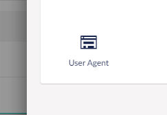

# User Agent for Umbraco Forms 
A field type that will capture the browser user agent string for the submitted form. 

<!-- ## Installation
This package can be installed by downloading the UserAgent for Umbraco Forms package archive from the Packages section from Our Umbraco and installing it within the backoffice. -->

## Using the User Agent field for Umbraco Forms
While editing an Umbraco Form, select the *User Agent* field from the collection of available fields types and save the form.

With the field included on a submitted form, the browser user agent string will be recorded with the submission.

## Additional information
The idea of this was sparked by having incorporated a field like this in past 'Help' or 'Contact Us' form implementations.  

The information gathered can prove valuable in communications with the submitting user.